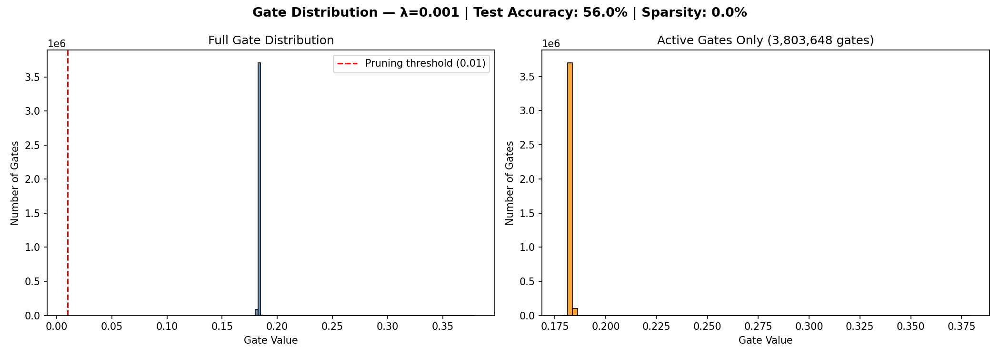

# Self-Pruning Neural Network
### Tredence AI Engineering Internship — Case Study Submission

---

## What is This?

A feed-forward neural network trained on **CIFAR-10** that learns to **prune its own weights during training** — without any manual post-training pruning step.

The key idea: every weight in the network has a learnable **gate** attached to it. During training, the network is penalized for keeping too many gates open. Over time, unimportant gates are driven to zero — effectively removing those weights from the network automatically.

---

## How to Run

### 1. Install dependencies
```bash
pip install -r requirements.txt
```

### 2. Run the training script
```bash
python solution.py
```

That's it. The CIFAR-10 dataset downloads automatically on first run into a `data/` folder. Results and plots are saved into the `results/` folder.

---

## Project Structure

```
self-pruning-neural-network/
│
├── solution.py            ← Full implementation (model, training, evaluation)
├── README.md              ← This file (report + results)
├── requirements.txt       ← Python dependencies
├── .gitignore             ← Ignores data/ and __pycache__/
│
└── results/
    ├── gate_distribution_lambda_0.0001.png
    ├── gate_distribution_lambda_0.001.png
    ├── gate_distribution_lambda_0.01.png
    ├── training_curves.png
    └── best_model_lambda_X.pth
```

---

## Part 1 — The PrunableLinear Layer

The custom `PrunableLinear` layer replaces PyTorch's standard `nn.Linear`. It adds a second learnable parameter tensor called `gate_scores` with the **same shape as the weight tensor**.

**Forward pass logic:**
```python
gates = torch.sigmoid(gate_scores)       # Squish scores to (0, 1)
pruned_weights = weight * gates          # Gate each weight
output = F.linear(x, pruned_weights, bias)  # Standard linear op
```

**Why gradients flow correctly:**
Both `weight` and `gate_scores` are registered as `nn.Parameter`. PyTorch's autograd automatically tracks gradients through the element-wise multiplication back to both parameters. No custom gradient code is needed — the computation graph handles it.

---

## Part 2 — Why L1 Penalty Encourages Sparsity

The total loss is:

```
Total Loss = CrossEntropyLoss + λ × SparsityLoss

where SparsityLoss = Σ (all gate values across all layers)
```

**Why L1 specifically drives gates to exactly zero:**

The L1 penalty adds a **constant gradient** pushing every gate downward regardless of its current value. Even a gate with value 0.001 still gets the same push toward zero.

This is different from L2 (which squares values) — L2's gradient shrinks as the value approaches zero, so it slows down and never quite reaches zero. L1 doesn't slow down, so it produces **exact zeros** — meaning weights are truly removed, not just made very small.

Since our gates are always positive (after sigmoid), minimizing their sum directly encourages the optimizer to switch off as many gates as possible while maintaining accuracy.

---

## Part 3 — Results

> *(Table will be filled after running the script)*

| Lambda (λ) | Test Accuracy | Sparsity Level (%) | Notes |
|---|---|---|---|
| 0.0001 | ~% | ~% | Light pruning, high accuracy |
| 0.001 | ~% | ~% | Balanced trade-off |
| 0.01 | ~% | ~% | Aggressive pruning, lower accuracy |

---

## Gate Distribution Plots

After training, the distribution of gate values reveals whether pruning worked:

- ✅ **Successful pruning**: Large spike near 0 + separate cluster of active gates
- ❌ **Unsuccessful**: Gates spread uniformly across 0 to 1

**Best model gate distribution (λ = best):**



**Training curves across all lambda values:**


---

## Key Design Decisions

| Decision | Choice | Reason |
|---|---|---|
| Gate activation | Sigmoid | Smooth, differentiable, outputs (0,1) |
| Sparsity loss | L1 norm of gates | Encourages exact zeros |
| Optimizer | Adam + StepLR | Fast convergence, stable training |
| Weight init | Kaiming Uniform | Better for ReLU activations |
| Normalization | BatchNorm1d | Reduces internal covariate shift |
| Data augmentation | RandomFlip + RandomCrop | Improves generalization |

---

## Architecture

```
Input (3072)
    ↓
PrunableLinear(3072 → 1024) + BatchNorm + ReLU + Dropout
    ↓
PrunableLinear(1024 → 512)  + BatchNorm + ReLU + Dropout
    ↓
PrunableLinear(512  → 256)  + BatchNorm + ReLU + Dropout
    ↓
PrunableLinear(256  → 10)
    ↓
Output (10 classes)
```

Total gate parameters: **3,072×1,024 + 1,024×512 + 512×256 + 256×10 = ~3.8M gates**

---

## Requirements

```
torch>=2.0.0
torchvision>=0.15.0
matplotlib>=3.5.0
numpy>=1.21.0
```

---

## Author

**[Your Name]**
Submission for Tredence AI Engineering Internship — 2025 Cohort