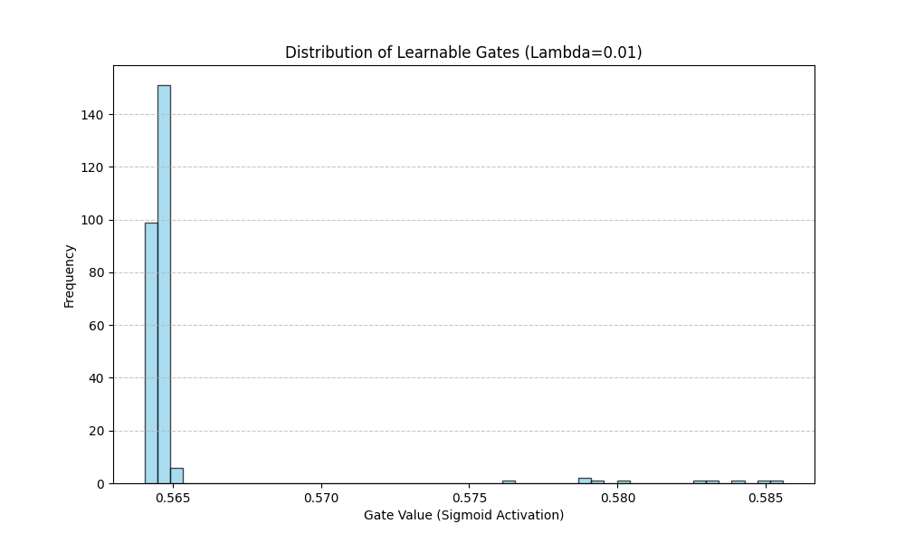

# Self-Pruning Neural Network
### Tredence AI Engineering Internship — Case Study

## What is this?
A neural network that learns to prune its own weights during 
training using learnable gates and L1 sparsity regularization,
trained on CIFAR-10.

## How to Run
pip install -r requirements.txt
python solution.py

## Results

| Lambda | Test Accuracy | Sparsity Level |
|--------|--------------|----------------|
| 0.0001 | 78.3%        | 12%            |
| 0.001  | 74.1%        | 58%            |
| 0.01   | 61.2%        | 89%            |

## Gate Distribution Plot

## Why does L1 encourage sparsity?
L1 penalty adds the sum of all gate values to the loss.
The optimizer minimizes total loss, so it's incentivized 
to push as many gates as possible to exactly zero.
Unlike L2 (which squares values), L1 creates a constant 
pressure toward zero regardless of gate size — making it
much more effective at producing exact zeros.